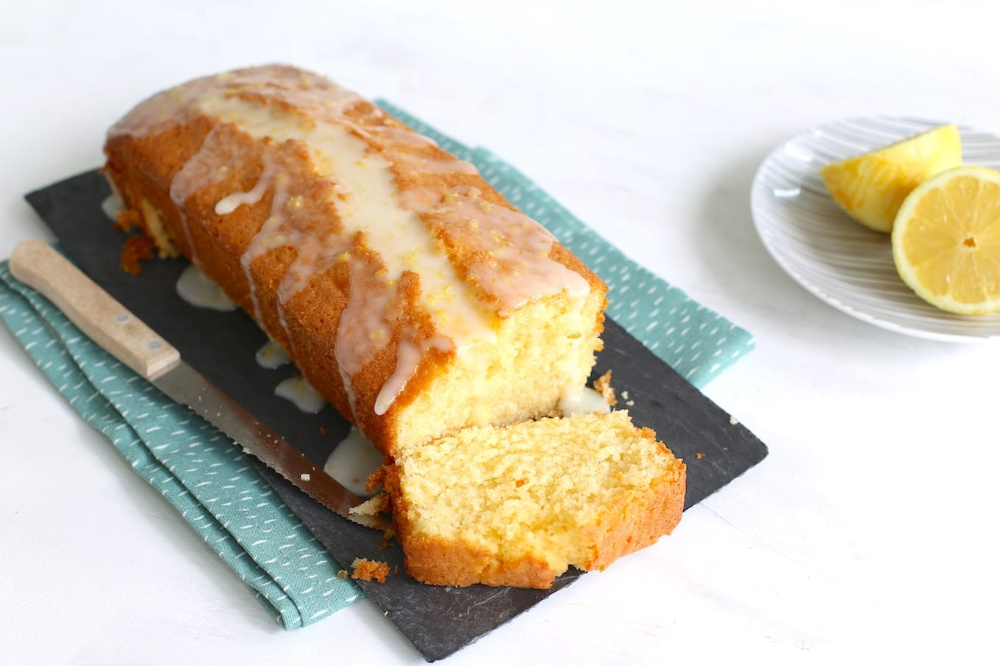

# Ingrediëntenlijst
## Voor de cake
### 200 gr suiker
### 200 gr boter, op kamertemperatuur
### 1 citroen, rasp
### ¼ tl zout
### 4 eieren, op kamertemperatuur
### 200 gr bloem
### 1½ tl bakpoeder
### Voor de citroensiroop
### 1 citroen, sap
### 75 gr poedersuiker
## Verder nodig
### boter, om in te vetten

# Bereiding: Frisse citroencake
Verwarm de oven voor op 160 ᵒC . Vet een cakevorm van 25 centimeter in en bekleed de bodem en twee zijkanten met bakpapier. Doe de suiker, boter, citroenrasp en het zout in een kom en mix dit in enkele minuten tot een romig geheel. Voeg de eieren één voor één toe en klop het beslag na elk ei goed door. Spatel tot slot de bloem en het bakpoeder door het beslag. Verdeel het beslag over de cakevorm en strijk de bovenkant glad. Bak de citroencake in 60-75 minuten goudbruin en gaar.

Meng, terwijl de cake nog in de oven staat, het citroensap met de poedersuiker. Haal de cake als deze gaar is uit de oven, maar laat hem nog wel in de vorm zitten. Prik de cake meerdere keren in met een satéprikker, zodat de citroensiroop er goed in kan trekken. Giet lepel voor lepel de siroop over de warme cake tot alle siroop op is. Laat de cake 10 minuten afkoelen in de vorm en stort hem vervolgens op een rooster om verder af te koelen.